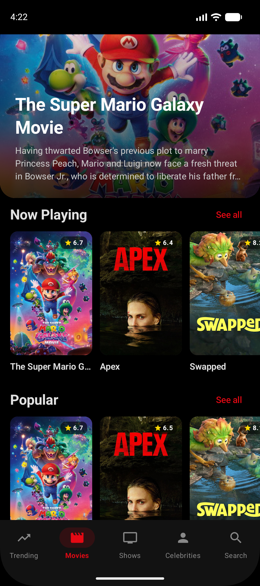
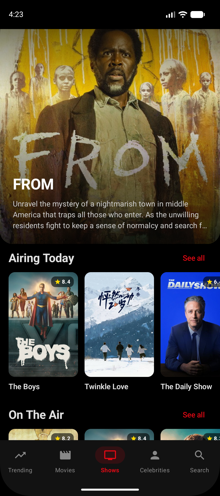
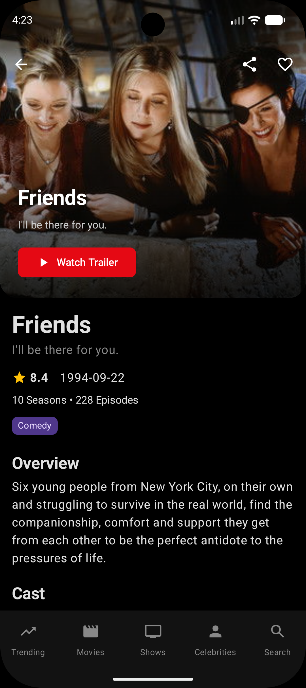
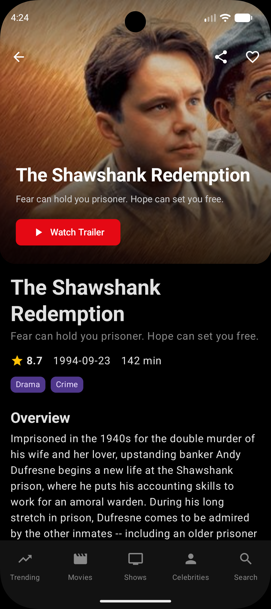
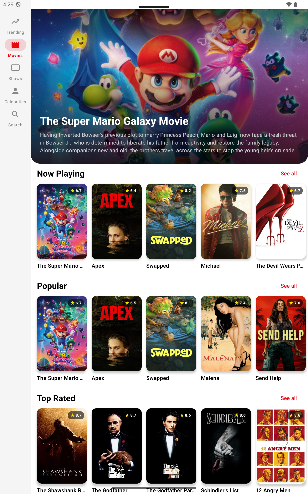
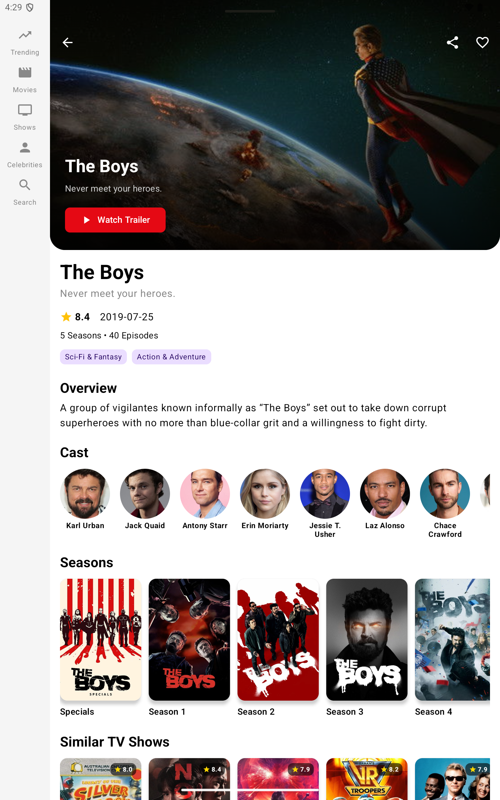
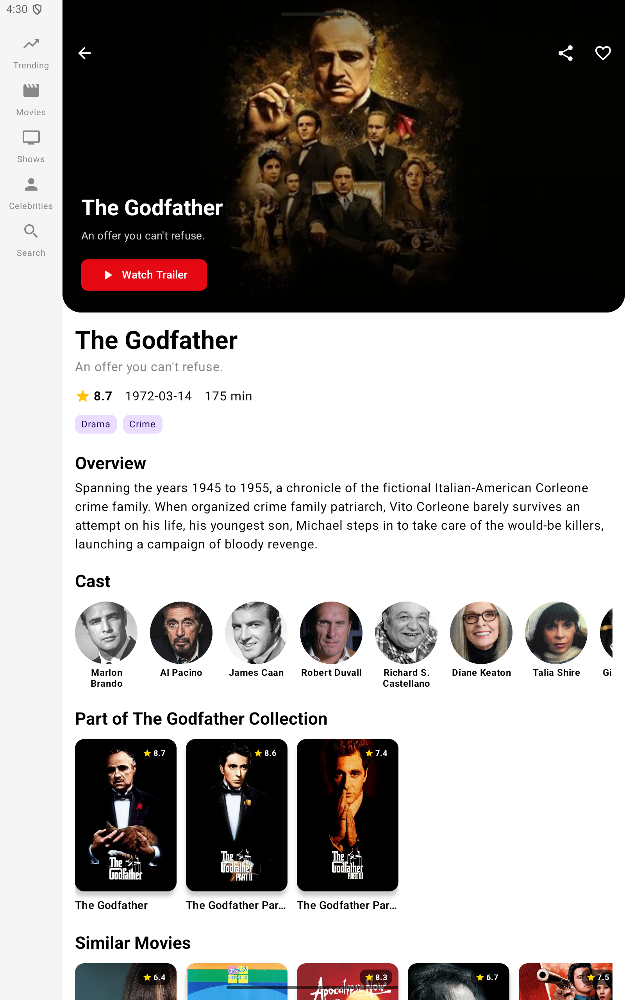
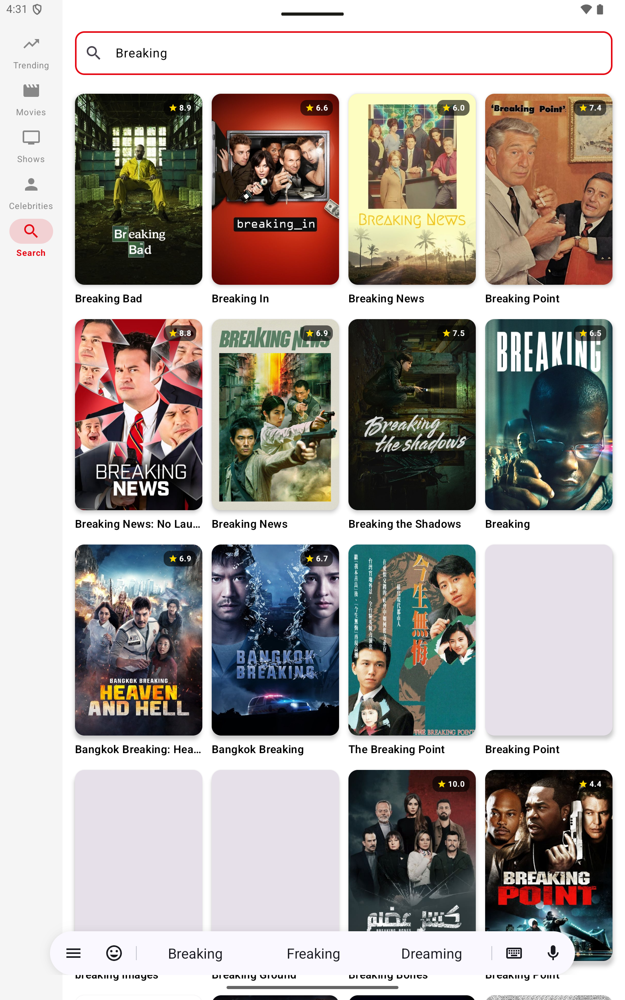
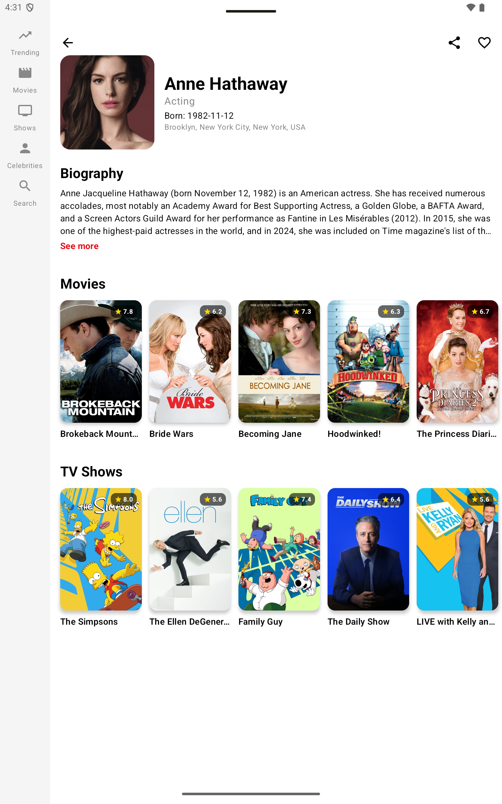

# Movies & TV Shows 🎬

A modern, high-performance Android application built with **Jetpack Compose** that allows users to discover trending movies, TV shows, and celebrities using the [TMDB API](https://www.themoviedb.org/documentation/api).

The app features a premium "Cinema" theme with deep blacks and bold red accents, providing an immersive discovery experience across phones and tablets.

---

## ✨ Features

- **🏠 Trending Hub**: Stay updated with the most popular content across movies, TV, and people.
- **🎬 Movie Discovery**: Explore "Now Playing", "Popular", "Top Rated", and "Upcoming" movies.
- **📺 TV Show Explorer**: Browse "Airing Today", "On The Air", and "Popular" TV series.
- **📺 Trailer Integration**: Watch official trailers directly on YouTube from the movie or TV show detail screens.
- **❤️ Personalization**: Mark your favorites and share content with friends directly from the app.
- **👤 Celebrity Spotlights**: 
    - **Popular Section**: A clean grid of top-rated celebrities.
    - **Trending Section**: A modern list layout with circular avatars.
    - **📖 Smart Biography**: Interactive "See more/See less" biography section for a clean reading experience.
- **🔍 Universal Search**: Quickly find movies, TV shows, or people in a streamlined grid interface.
- **📱 Adaptive Layouts**: Fully responsive UI that adapts between Navigation Bar (Phone) and Navigation Rail (Tablets/Foldables).
- **🌟 Immersive Hero Sections**: Large, high-impact featured items at the top of discovery screens with safe-area aware status bars.

---

## 🛠 Tech Stack

- **Language**: [Kotlin](https://kotlinlang.org/)
- **UI Framework**: [Jetpack Compose](https://developer.android.com/jetpack/compose) (Material 3)
- **Adaptive UI**: [Navigation Suite Scaffold](https://developer.android.com/jetpack/compose/layouts/adaptive)
- **Dependency Injection**: [Dagger Hilt](https://dagger.dev/hilt/)
- **Networking**: [Retrofit](https://square.github.io/retrofit/) with [OkHttp](https://square.github.io/okhttp/)
- **Serialization**: [Kotlinx Serialization](https://kotlinlang.org/docs/serialization.html)
- **Image Loading**: [Coil](https://coil-kt.github.io/coil/)
- **Navigation**: [Jetpack Compose Navigation](https://developer.android.com/jetpack/compose/navigation) (Type-safe routes)
- **Architecture**: MVVM with Clean Architecture principles

---

## 📸 Screenshots

### Phone Experience
| Trending | Movies | Search | Details |
| :---: | :---: | :---: | :---: |
|  |  |  |  |

### Tablet Experience



<br>



<br>



<br>



<br>



---

## 🚀 Getting Started

### 1. Prerequisites
- Android Studio Ladybug | 2024.2.1 or newer
- JDK 17
- A TMDB API Key (Get one [here](https://www.themoviedb.org/settings/api))

### 2. Configuration
To run the app, you need to add your TMDB API key to the `local.properties` file in the root directory:

```properties
tmdb_api_key=YOUR_API_KEY_HERE
```

### 3. Build & Run
1. Clone the repository.
2. Open the project in Android Studio.
3. Sync Gradle and run the `app` module on an emulator or physical device.

---

## 📜 License
This project is for educational purposes and uses the TMDB API but is not endorsed or certified by TMDB.
